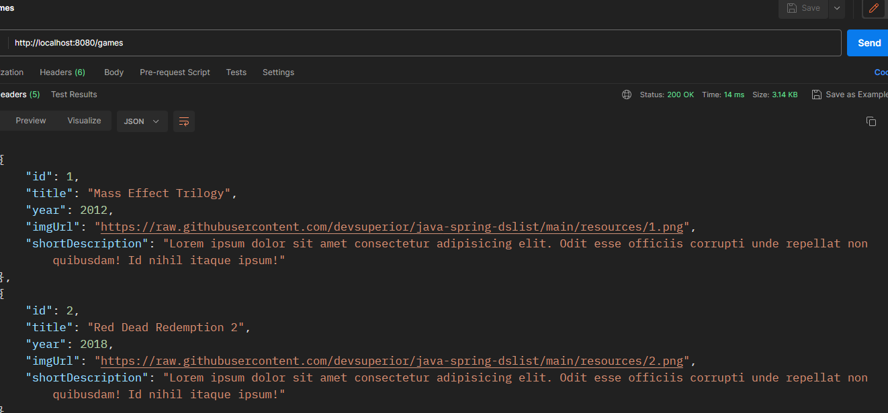

# Dslist
A aplicação permite a pesquisa de jogos, onde o usuário pode encontrar informações sobre diferentes títulos e classificar os jogos com base em sua opinião.

# Configurações

### Requisitos
  - [Java 17](https://www.oracle.com/java/technologies/javase/jdk17-archive-downloads.html)


**Clone o projeto e acesse a pasta**

``` bash
git clone git@github.com:matheusgmello/dslist.git && cd dslist
```
- Rode a aplicação (`./mvnw spring-boot:run`)
- Teste a api no Rest Client no endereço (`localhost:8080`)

## Rotas

- `GET Games`: Busca a lista de jogos
- `GET Games by ID`: Busca um jogo por meio do ID
- `GET Lists`: Busca a categoria das listas de jogos
- `GET Lists by ID from Games`: Busca a lista categorizado pelo gênero (ID) do jogos
- `POST Lists Replacement`: Permite o usuário organizar em base da sua opinião

## Diagrama

<p align="justify">
  
</p>

## Tecnologias 

- [Java 17](https://www.oracle.com/java/technologies/javase/jdk17-archive-downloads.html)
- [Spring Boot](https://spring.io/projects/spring-boot)
- [PostgreSQL](https://www.postgresql.org/docs/)

<!--START_SECTION:footer-->
<br />

## 🔗 Connect with me
[](https://linkedin.com/in/matheusgmello)
[](https://www.reddit.com/user/math7zw)
[](https://github.com/matheusgmello/)


<!--END_SECTION:footer-->
  